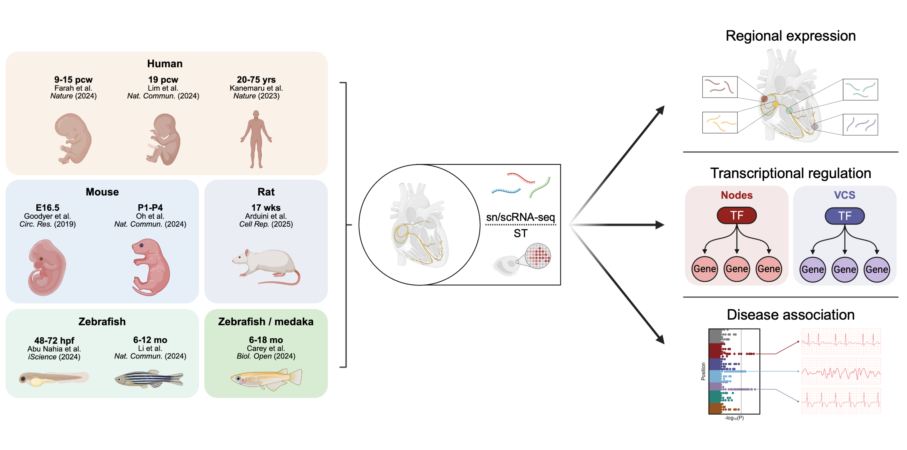

# Comparison of transcriptional heterogeneity in the vertebrate CCS

This repository contains custom code and figure scripts for the manuscript titled **"Conservation and divergence of transcriptional heterogeneity in the cardiac conduction system"** (2025). The study compares gene expression profiles across the cardiac conduction system (CCS) in humans and model organisms (mouse, rat, zebrafish, medaka) using publicly available single-cell and single-nucleus RNA sequencing data. All scripts are organized by main and supplementary figures and contain the required code for preprocessing, analysis, and visualization. The data used in this study is available through an interactive online web application, CCS atlas, [linked here](https://ccsatlas.com/), which provides interactive access to processed Seurat objects.

Below is a summary of the datasets used:

| **Species**                | **Stages included**         | **Modality**         | **Reference**                     |
|----------------------------|-----------------------------|----------------------|-----------------------------------|
| **Human**                  | Fetus (9-15 pcw)            | scRNA-seq, MERFISH   | [Farah et al., Nature (2024)](https://doi.org/10.1038/s41586-024-07171-z)       |
| **Human**                  | Fetus (19 pcw)              | snRNA-seq            | [Lim et al., Nat. Commun. (2024)](https://doi.org/10.1038/s41467-024-54337-4)   |
| **Human**                  | Adult (20-75 yrs)           | snRNA-seq, Visium    | [Kanemaru et al., Nature (2023)](https://doi.org/10.1038/s41586-023-06311-1)    |
| **Human**                  | iPSC-SAN (day 0 to day 19)  | scRNA-seq            | [Wiesinger et al., eLife (2022)](https://doi.org/10.7554/elife.76781)    |
| **Mouse**                  | Embryo (E16.5)              | scRNA-seq            | [Goodyer et al., Circ. Res. (2019)](https://doi.org/10.1161/circresaha.118.314578) |
| **Mouse**                  | Postnatal (P1-P4)           | scRNA-seq            | [Oh et al., Nat. Commun. (2024)](https://doi.org/10.1038/s41467-024-50849-1)    |
| **Rat**                    | Adult (17 wks)              | snRNA-seq            | [Arduini et al., Cell Rep. (2025)](https://doi.org/10.1016/j.celrep.2024.115091)  |
| **Zebrafish**              | Embryo (48-72 hpf)          | scRNA-seq            | [Abu Nahia et al., iScience (2024)](https://doi.org/10.1016/j.isci.2024.110083) |
| **Zebrafish**              | Adult (6-12 mo)             | scRNA-seq            | [Li et al., Nat. Commun. (2025)](https://doi.org/10.1038/s41467-025-59070-0)    |
| **Zebrafish and medaka**   | Adult (6-18 mo)             | scRNA-seq            | [Carey et al., Biol. Open. (2024)](https://doi.org/10.1242/bio.060156)  |

## Contents

### Main Figures

- `MainFig1_Datasets_Dendrogram.Rmd`: Uniform manifold approximation and projection (UMAP) visualization of datasets, and hierarchical clustering of CCS cell types from each species/stage.
- `MainFig2_MouseHuman_PanCCS_Nodes_VCS.Rmd`: Human-mouse comparison of genes enriched in the whole CCS (Pan-CCS), nodes (sinoatrial node and compact atrioventricular node), or ventricular conduction system (VCS; *His* bundle and *Purkinje* fibers).
- `MainFig3_MouseHuman_SAN_cAVN_HIS_PF.Rmd`: Human-mouse comparison of genes enriched in individual CCS components (sinoatrial node, compact atrioventricular node, *His* bundle, and *Purkinje* fibers.
- `MainFig4_Rat.Rmd`: Comparison of CCS-enriched genes between rat, human, and mouse.
- `MainFig5_Zebrafish_Medaka.Rmd`: Comparison of CCS-enriched genes between teleost fish (zebrafish & medaka), human, and mouse.
- `MainFig6_SCENIC.Rmd` and `MainFig6_SCENIC_AUC_RSS.ipynb`: Regulatory network inference in the human CCS using [SCENIC](https://github.com/aertslab/SCENIC).
- `MainFig7_Disease_Associations.Rmd`: Associations of conserved genes with conduction traits and disorders in humans (GWAS and rare coding variants).

### Supplementary Figures

- `SuppFig_Fetal_SAN_Integration.Rmd`: Integration and comparison of human fetal sinoatrial node datasets (9-15pcw and 19pcw).
- `SuppFig_Human_Fetal_Annotation.Rmd`: Annotation of fetal human CCS.
- `SuppFig_Mouse_Human_Correlation.Rmd`: Correlation between human and mouse CCS populations.
- `SuppFig_Rat_Annotation.Rmd`: Annotation of adult rat CCS. 
- `SuppFig_Zebrafish_Adult_Annotation.Rmd`: Annotation of adult zebrafish CCS.

## Dependencies

### R

Analyses were performed using R v4.4.0. The following R packages were used throughout the analyses:

- [Seurat](https://satijalab.org/seurat/) (v5.0.3)
- [SeuratObject](https://cran.r-project.org/package=SeuratObject) (v5.0.2)
- [ggplot2](https://ggplot2.tidyverse.org/) (v3.5.1)
- [dplyr](https://dplyr.tidyverse.org/) (v1.1.4)
- [tidyr](https://tidyr.tidyverse.org/) (v1.3.1)
- [tibble](https://tibble.tidyverse.org/) (v3.2.1)
- [purrr](https://purrr.tidyverse.org/) (v1.0.2)
- [readr](https://readr.tidyverse.org/) (v2.1.5)
- [stringr](https://stringr.tidyverse.org/) (v1.5.1)
- [forcats](https://forcats.tidyverse.org/) (v1.0.0)
- [tidyverse](https://www.tidyverse.org/) (v2.0.0)
- [ComplexHeatmap](https://jokergoo.github.io/ComplexHeatmap-reference/book/) (v2.20.0)
- [ComplexUpset](https://github.com/krassowski/complex-upset) (v1.3.3)
- [pheatmap](https://cran.r-project.org/package=pheatmap) (v1.0.12)
- [scCustomize](https://github.com/samuel-marsh/scCustomize) (v2.1.2)
- [ggalluvial](https://corybrunson.github.io/ggalluvial/) (v0.12.5)
- [circlize](https://jokergoo.github.io/circlize_book/book/) (v0.4.16)
- [scales](https://scales.r-lib.org/) (v1.3.0)
- [lubridate](https://lubridate.tidyverse.org/) (v1.9.3)
- [sp](https://cran.r-project.org/package=sp) (v2.1-4)
- [Matrix](https://cran.r-project.org/package=Matrix) (v1.7-0)

### Python

Analyses were performed using Python v3.10.12. The following Python packages were used throughout the analyses:

- [adjustText](https://github.com/Phlya/adjustText) (v0.8)  
- [loompy](https://github.com/linnarsson-lab/loompy) (v3.0.7)  
- [matplotlib](https://matplotlib.org/) (v3.7.1)  
- [numpy](https://numpy.org/) (v1.24.0)  
- [pandas](https://pandas.pydata.org/) (v1.5.3)  
- [scipy](https://scipy.org/) (v1.14.0)  
- [scikit-learn](https://scikit-learn.org/) (v1.3.0)  
